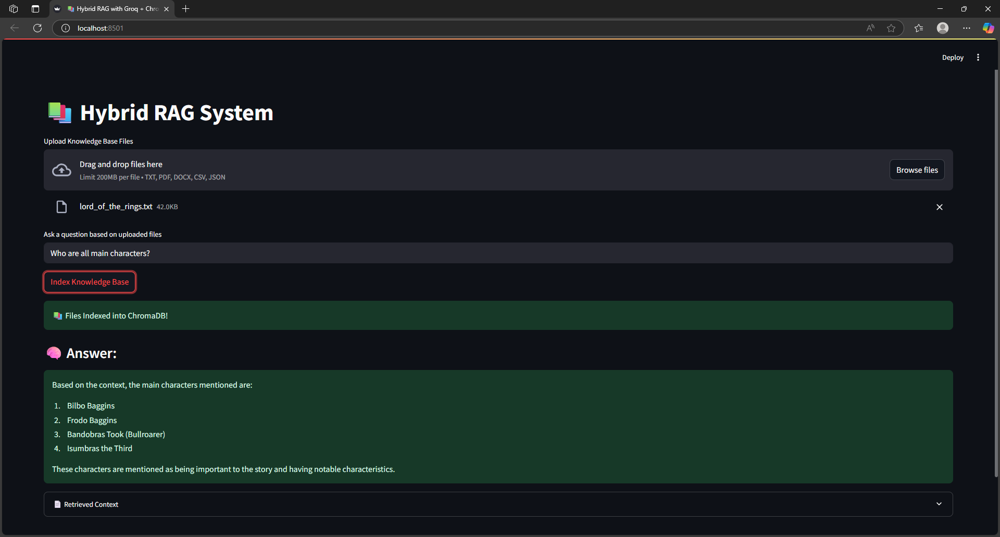

# 🤖 Hybrid-RAG-Assistant

A powerful document-based chatbot built using **Hybrid Retrieval-Augmented Generation (RAG)** combining **semantic similarity search (ChromaDB + Ollama Embeddings)** with **keyword matching**, and powered by **Groq’s LLaMA 3** for generating accurate, grounded answers.

## 🚀 Features

- 📄 **Supports multi-format knowledge ingestion**: `.txt`, `.pdf`, `.csv`, `.docx`, `.json`
- 🔍 **Hybrid search strategy**: Combines semantic + keyword-based document retrieval
- 🧠 **Groq LLM integration**: Fast, accurate answers using `llama3-8b-8192`
- 📚 **Built with Streamlit**: Simple, intuitive web interface

---

## 🛠️ Setup Instructions

1. **Clone the repo**
   ```bash
   git clone https://github.com/your-username/Hybrid-RAG-Assistant.git
   cd Hybrid-RAG-Assistant
   ```

2. **Create a virtual environment and activate it**
   ```bash
   python -m venv venv
   source venv/bin/activate  # On Windows: venv\Scripts\activate
   ```

3. **Install dependencies**
   ```bash
   pip install -r requirements.txt
   ```

4. **Set up your environment variables**

   Create a `.env` file in the root directory with your [Groq API key](https://console.groq.com/keys):

   ```
   GROQ_API_KEY=your_groq_api_key_here
   ```

---

## 🧪 Run the App

```bash
streamlit run main.py
```

Then open [http://localhost:8501](http://localhost:8501) in your browser.

---

## 📂 File Structure

```bash
Hybrid-RAG-Assistant/
├── main.py                      # Main Streamlit app
├── utils/
│   ├── loader.py              # Reads files (.txt, .pdf, .docx, etc.)
│   └── chunker.py             # Chunks the documents into smaller pieces
├── .env                       # Environment file for secrets
├── requirements.txt           # Python dependencies
└── README.md
```

---

## 💡 How It Works

1. **Upload Files** → `.txt`, `.pdf`, `.docx`, `.csv`, `.json`
2. **Indexing** → Files are chunked and embedded using `nomic-embed-text`
3. **Hybrid Retrieval** → 
   - Dense vector similarity search (via ChromaDB)
   - Keyword overlap scoring
4. **Answer Generation** → Groq's LLaMA3 answers based strictly on retrieved context

---

## 📌 Notes

- Make sure Groq API is accessible from your location.
- Supports up to 10 documents combined via hybrid scoring.
- Customize retrieval count or models in `main.py`.

---

## 📃 License

MIT License. Free to use with attribution.

---

## 🙏 Acknowledgements

- [Groq LLM](https://groq.com/)
- [LangChain](https://www.langchain.com/)
- [ChromaDB](https://www.trychroma.com/)
- [Streamlit](https://streamlit.io/)

---

## ✨ Demo Preview


